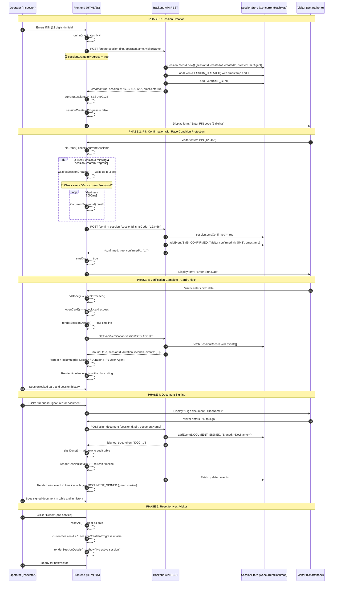

# Verification Process — Automated System (LMIS)

## Overview for Stakeholders (Business Process)
The system is designed to reliably identify visitors at Employment Centers in order to safely process benefit payments and grant access to personal unemployment records.

**Usage Scenario:**
1. The inspector logs into the system using the Ministry's Single Sign-On (SSO Keycloak).
2. A visitor arrives for an appointment. The inspector requests their passport and enters the 12-digit INN into the operator's system.
3. The system searches for the visitor in the database (search is available by Name or a unique System ID issued during the first visit).
4. An authentication request is pushed to the visitor's personal smartphone (or terminal): they must enter their secret 6-digit PIN and Date of Birth.
5. The data from the inspector's terminal and the visitor's device are synchronized and verified on the backend server.
6. If the data matches, the inspector is granted access to the visitor's full Profile Card. The Audit Log records the successful verification.
7. **Electronic Signature (New):** When a physical signature is required for a document (e.g., *Job Search Application* or *Allowance Order*), the operator clicks "Request Signature". The visitor's smartphone displays the document name and asks for their PIN code. Upon entering the PIN, the document is marked as legally signed, and the exact timestamp and document name are recorded in the Audit Log.

## Overview for Developers (Technical Workflow)

### Architecture
* **Frontend:** Single-page HTML/CSS/VanillaJS. It consists of two logical columns: the operator workspace (`col-op`) and the visitor's smartphone emulator (`col-ph`).
* **Backend:** Java Spring Boot REST API (`VerificationController.java`) which serves the static files and manages verification sessions.
* **Session Manager:** ConcurrentHashMap on backend. Each session contains: sessionId, inn, smsConfirmed, createdAt, createdIp, createdUserAgent, events[].
* **SSO:** Planned integration with the existing local Keycloak instance (`192.168.3.10`).

### UI States
The interface state is managed by toggling CSS classes (`.sc.on` for operator screens and `.ps.on` for phone screens).
* `sc-login` -> `sc-search` -> `sc-step1` (INN Input) -> `sc-step2` (Data Verification) -> `sc-open` (Card Opened, Document Management).
* Phone: `ph-wait` -> `ph-pin` -> `ph-bd` -> `ph-result` -> `ph-sign` (Signing specific document).

### Frontend Session Logic

**Global Variables:**
```javascript
let currentSessionId = '';              // Active session (set on create or confirm)
let sessionCreateInProgress = false;    // Flag for race-condition protection
let innVal = '';                        // Entered INN
let smsDone_ = false;                   // Flag: SMS confirmed
```

**Main Async Functions:**

1. **`async function onInn(value)`** — Triggered on INN input
   - Validates INN (12 digits)
   - If INN is valid and session not yet created → initiates `apiPost('/create-session')`
   - Saves session ID to `currentSessionId`
   - Transitions to PIN entry screen

2. **`async function pinDone()`** — Triggered on "Confirm PIN" button click
   - Checks for `currentSessionId` (otherwise shows error)
   - Calls `apiPost('/confirm-session', {sessionId, smsCode})`
   - If successful → sets `smsDone_ = true`
   - Transitions to verification result screen

3. **`async function renderSessionDetails()`** — Renders "Detailed Session Timeline"
   - Fetches `GET /api/verification/session/{currentSessionId}`
   - Displays: session #, creation date/time, duration, IP, User-Agent
   - Renders timeline events (color-coded: SMS_CONFIRMED=blue, DOCUMENT_SIGNED=green)
   - Called after `openCard()` and `signDone()`

4. **`async function waitForSessionCreation(maxWaitMs=3000)`** — Race-condition protection
   - Asynchronously waits for session creation to complete
   - Polls every 60ms: is `sessionCreateInProgress` = false?
   - Maximum 3 second wait before returning error

### API Contracts (Updated)

**1. Create Session**
* `POST /api/verification/create-session`
* Payload: `{"inn": "500123456789", "operatorName": "...", "visitorName": "..."}`
* Response: 
  ```json
  {
    "created": true,
    "sessionId": "SES-ABC123",
    "smsSent": true,
    "createdAt": "2026-04-13T10:30:00",
    "ip": "192.168.1.100",
    "userAgent": "Mozilla/5.0..."
  }
  ```

**2. Confirm Session via SMS Code**
* `POST /api/verification/confirm-session`
* Payload: `{"sessionId": "SES-ABC123", "smsCode": "123456"}`
* Response:
  ```json
  {
    "confirmed": true,
    "sessionId": "SES-ABC123",
    "confirmedAt": "2026-04-13T10:31:00"
  }
  ```

**3. Sign Document**
* `POST /api/verification/sign-document`
* Payload: `{"sessionId": "SES-ABC123", "pin": "123456", "documentName": "Job Search Application"}`
* Response:
  ```json
  {
    "signed": true,
    "token": "DOC-ABC123XYZ789",
    "signedAt": "2026-04-13T10:32:00"
  }
  ```

**4. Get Session Timeline (New)**
* `GET /api/verification/session/{sessionId}`
* Response:
  ```json
  {
    "found": true,
    "sessionId": "SES-ABC123",
    "createdAt": "2026-04-13T10:30:00",
    "durationSeconds": 120,
    "createdIp": "192.168.1.100",
    "createdUserAgent": "Mozilla/5.0...",
    "events": [
      {
        "type": "SESSION_CREATED",
        "description": "Session created by operator...",
        "timestamp": "2026-04-13T10:30:00",
        "ip": "192.168.1.100",
        "userAgent": "Mozilla/5.0..."
      },
      {
        "type": "SMS_CONFIRMED",
        "description": "Visitor confirmed session via SMS",
        "timestamp": "2026-04-13T10:31:00",
        "ip": "192.168.1.101",
        "userAgent": "Mozilla/5.0..."
      }
    ]
  }
  ```
### SMS Process (In Detail)

**When SMS is sent:**
1. Inspector enters visitor's TIN in the input field
2. System calls `POST /api/verification/create-session`
3. **At this moment the system sends an SMS code to the visitor's mobile number**

**What SMS contains:**
```
Your confirmation code: 123456
(In demo mode always 123456)
```

**How SMS Works (Backend):**

In `VerificationController.java`:
```java
@PostMapping("/create-session")
public Map<String, Object> createSession(...) {
    // 1. Create SessionRecord
    SessionRecord session = new SessionRecord();
    session.sessionId = "SES-ABC123";
    
    // 2. Log SMS_SENT event
    addSessionEvent(session, "SMS_SENT", 
        "One-time SMS code sent to visitor's phone number", 
        request);
    
    // 3. In production system this would be:
    // smsProvider.send(visitorPhone, "Code: 123456");
    
    // 4. In demo mode we just log it
    response.put("demoSmsCode", "123456");  // ← Development only!
    response.put("smsSent", true);
}
```

**Frontend SMS Flow (JavaScript):**

```javascript
// Step 1: Inspector enters visitor's TIN
async function onInn(value) {
    innVal = value.replace(/\D/g, '');
    
    // ... validation ...
    
    if (innOk && !currentSessionId && !sessionCreateInProgress) {
        sessionCreateInProgress = true;
        
        // Step 2: Create session (SMS is sent on backend)
        const sessionResp = await apiPost('/create-session', {
            inn: innVal,
            operatorName: OPERATOR_NAME,
            visitorName: VISITOR_NAME
        });
        
        if (sessionResp.created) {
            currentSessionId = sessionResp.sessionId;
            document.getElementById('op-bd').textContent = 
                'SMS sent • ' + currentSessionId;
            setSessionIndicator('Session created, SMS sent', 'var(--green)');
        }
        sessionCreateInProgress = false;
    }
}

// Step 3: PIN input form appears on phone screen
// (automatically switches to ph-pin screen)
// Visitor sees: "Enter 6-digit code from SMS"

// Step 4: Visitor enters 6-digit code (in demo: 123456)
function pp(d) { 
    if (pinVal.length >= 6) return; 
    pinVal += d;  // Add digit
    updDots();    // Update visual dots
}

// Step 5: Visitor clicks "Confirm"
async function pinDone() {
    if (pinVal.length < 6) return;  // Error if < 6 digits
    
    // Send code for confirmation
    const confirmResp = await apiPost('/confirm-session', {
        sessionId: currentSessionId,
        smsCode: pinVal  // ← Code from SMS
    });
    
    if (!confirmResp.confirmed) {
        // Error: SMS code is incorrect or expired
        document.getElementById('pr-ring').textContent = '✕';
        document.getElementById('pr-title').textContent = 'SMS not confirmed';
        return;
    }
    
    // Success!
    smsDone_ = true;
    document.getElementById('op-pin').textContent = '✓ SMS code confirmed';
}
```

**Backend Verification (Java):**

```java
@PostMapping("/confirm-session")
public Map<String, Object> confirmSession(...) {
    String sessionId = payload.get("sessionId");
    String smsCode = payload.get("smsCode");
    
    SessionRecord session = sessionsById.get(sessionId);
    if (session == null) {
        return error("Session not found");
    }
    
    // CRITICAL: Verify SMS code
    // ⚠️ In demo mode this is always "123456"
    // 🔒 In production this comes from real SMS provider
    if (!DEMO_SMS_CODE.equals(smsCode)) {  // DEMO_SMS_CODE = "123456"
        return error("Invalid SMS code");
    }
    
    // Code is correct - confirm session
    session.smsConfirmed = true;
    session.confirmedAt = LocalDateTime.now();
    
    // Log event
    addSessionEvent(session, "SMS_CONFIRMED", 
        "Visitor confirmed session via SMS code", request);
    
    return success("Session confirmed");
}
```

**SMS Timeline in Session History:**

After SMS confirmation, a record appears in session history:
```json
{
    "type": "SMS_CONFIRMED",
    "description": "Visitor confirmed session via SMS code",
    "timestamp": "2026-04-13T10:31:00",
    "ip": "192.168.1.101",
    "userAgent": "Mozilla/5.0..."
}
```

**Visually in UI:**
- 📱 On phone screen → "✓ SMS code confirmed" (green checkmark)
- 👨‍💼 On inspector's screen → gray table becomes green with text "✓ SMS code confirmed"

**Demo vs Production Modes:**

| Parameter | Demo Mode | Production |
|-----------|-----------|-----------|
| SMS code | Always `123456` | Random 6-digit code |
| SMS sending | No (logging only) | Real SMS provider (Twilio, Nexmo, etc.) |
| Code TTL | No check | 5-10 minutes (expiration) |
| Attempts | Unlimited | Max 3 attempts |
| Response | `"demoSmsCode": "123456"` | Hidden from frontend |
### Error Handling & Race-Conditions

**Problem:** If a visitor enters PIN too quickly before session creation completes, confirming a non-existent session causes an error.

**Solution:**
1. `onInn()` sets `sessionCreateInProgress = true` and asynchronously creates session
2. `pinDone()` checks: if `!currentSessionId && sessionCreateInProgress`, calls `waitForSessionCreation()`
3. `waitForSessionCreation()` waits max 3 seconds for create-session to complete
4. If still no sessionId → shows error "Session Error"

---

## UML Sequence Diagram (Complete Workflow with Sessions)



### State Diagram (UI State Transitions)

```mermaid
stateDiagram-v2
    [*] --> sc-login: Page loads
    
    sc-login --> sc-search: Login button clicked
    sc-search --> sc-step1: "Search visitor" clicked
    
    sc-step1 --> sc-step1: INN input\n[onInn triggered]
    
    state "INN entered (valid)" as inn_ok {
        [*] --> create_session: sessionCreateInProgress=true
        create_session --> waiting: Awaiting /create-session
        waiting --> [*]: currentSessionId obtained
    }
    
    sc-step1 --> inn_ok: innOk && !currentSessionId
    inn_ok --> sc-step1: INN re-entered
    
    sc-step1 --> sc-step2: innOk && smsDone_\n"Proceed to Confirmation" button
    
    sc-step2 --> sc-open: Confirmation & card unlock
    sc-open --> sc-open: Document management (signing)
    sc-open --> sc-search: "Reset" button or session end
    sc-search --> [*]: Clear sessionId, innVal, smsDone_
```

### Component Diagram (System Architecture)

```mermaid
graph TB
    subgraph Frontend["Frontend (HTML/JS)"]
        DOM["DOM (index.html)"]
        CSS["Styles (CSS)"]
        JS["JS Logic (Async Functions)"]
        JS --> |renderSessionDetails| API
        JS --> |onInn, pinDone, signDone| API
    end
    
    subgraph Backend["Backend (Spring Boot)"]
        Controller["VerificationController"]
        SessManager["SessionStore<br/>(ConcurrentHashMap)"]
        EventLog["Event Log Builder<br/>(per session)"]
        Controller --> |read/write| SessManager
        Controller --> |append| EventLog
    end
    
    subgraph Request["HTTP Requests"]
        CreateSess["/create-session"]
        ConfirmSess["/confirm-session"]
        SignDoc["/sign-document"]
        GetSess["/session/{id}"]
    end
    
    JS --> CreateSess
    JS --> ConfirmSess
    JS --> SignDoc
    JS --> GetSess
    
    CreateSess --> Controller
    ConfirmSess --> Controller
    SignDoc --> Controller
    GetSess --> Controller
    
    DOM --> |renderUI| CSS
    SessManager --> |JSON response| JS
    EventLog --> |events[]| GetSess
    
    subgraph Visitor["Visitor Interface"]
        PhoneUI["Smartphone Emulator<br/>(col-ph)"]
    end
    
    DOM --> PhoneUI
```
