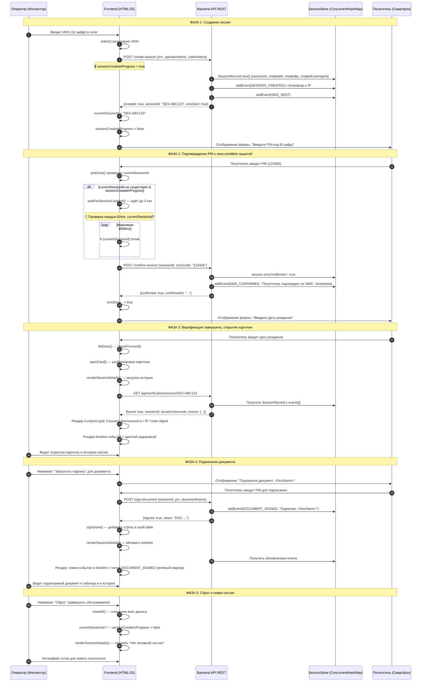

# Процесс верификации — Автоматизированная система (LMIS)

## Описание для Заказчика (Бизнес-процесс)
Система предназначена для надежной идентификации посетителей Центров занятости населения (ЦЗН) с целью выдачи пособий и доступа к личным карточкам безработных.

**Сценарий использования:**
1. Инспектор входит в систему через Единую систему входа Министерства (SSO Keycloak).
2. Посетитель приходит на прием. Инспектор запрашивает его паспорт и вводит 12-значный ИНН в систему оператора.
3. Система ищет посетителя в базе данных (поиск доступен по ФИО или системному ID, выданному при первой регистрации).
4. Посетителю на его личный смартфон (или терминал) приходит запрос на аутентификацию: он должен ввести свой секретный 6-значный PIN-код и Дату рождения.
5. Данные с экрана инспектора и экрана посетителя синхронизируются на сервере.
6. В случае совпадения данных инспектору открывается полная Карточка посетителя (уровень доступа повышен). На экране телефона отображается сообщение: "Все действия в рамках данной сессии считаются подтверждёнными вами согласно Соглашению о ПЭП № ___".
7. **Журнал посещений (Личный аудит):** После снятия блокировки активируется вкладка "Журнал посещений". В ней фиксируется статистика по конкретному посетителю (всего визитов, подписано документов) и ведется криптографически связанная история активности.
8. **Электронное подписание:** При необходимости подписать документ, оператор нажимает «Запросить подпись». На смартфоне посетителя появляется название документа и запрос PIN-кода. После подтверждения, посетителю отображается четкое название документа по центру экрана. Документ получает статус подписанного, а в Журнал посещений моментально добавляется запись: точное время, название документа, ссылка на скачивание PDF-оригинала и генерируется QR-код с хэшем документа в реестре.

## Описание для Разработчиков (Технический Workflow)

### Архитектура
* **Frontend:** HTML/CSS/VanillaJS. Два логических столбца: рабочее место оператора (`col-op`) и эмулятор смартфона посетителя (`col-ph`).
* **Backend:** Java Spring Boot REST API (`VerificationController.java`), отдающий статику и управляющий сессиями верификации.
* **Сессион-менеджер:** ConcurrentHashMap на бэкенде. Каждая сессия содержит: sessionId, inn, smsConfirmed, createdAt, createdIp, createdUserAgent, events[].
* **SSO:** Планируется интеграция с существующим Keycloak (`192.168.3.10`).

### Состояния интерфейса
Интерфейс управляется через смену CSS-классов `.sc.on` (экраны оператора) и `.ps.on` (экраны телефона).
* `sc-login` -> `sc-search` -> `sc-step1` (Ввод ИНН) -> `sc-step2` (Сверка данных) -> `sc-open` (Карточка открыта, работа с документами).
* Телефон: `ph-wait` -> `ph-pin` -> `ph-bd` -> `ph-result` -> `ph-sign` (Подписание конкретного документа).

### Frontend Логика Сессии

**Глобальные переменные:**
```javascript
let currentSessionId = '';              // Активная сессия (устанавливается при create или confirm)
let sessionCreateInProgress = false;    // Флаг для race-condition protection
let innVal = '';                        // Введённый ИНН
let smsDone_ = false;                   // Flag: SMS подтвержден
```

**Главные async функции:**

1. **`async function onInn(value)`** — Срабатывает при вводе ИНН
   - Валидирует ИНН (12 цифр)
   - Если ИНН корректен и сессия ещё не создана — инициирует `apiPost('/create-session')`
   - Сохраняет ID сессии в `currentSessionId`
   - Переходит на экран ввода PIN

2. **`async function pinDone()`** — Срабатывает при нажатии "Подтвердить PIN"
   - Проверяет наличие `currentSessionId` (иначе показывает ошибку)
   - Вызывает `apiPost('/confirm-session', {sessionId, smsCode})`
   - Если успешно — устанавливает `smsDone_ = true`
   - Открывает экран результата верификации

3. **`async function renderSessionDetails()`** — Рендерит "Развёрнутую историю сессии"
   - Запрашивает `GET /api/verification/session/{currentSessionId}`
   - Отображает: сессию №, дату/время создания, длительность, IP, User-Agent
   - Рендерит timeline event'ов (с цветовой кодировкой: SMS_CONFIRMED=синий, DOCUMENT_SIGNED=зелёный)
   - Вызывается после `openCard()` и `signDone()`

4. **`async function waitForSessionCreation(maxWaitMs=3000)`** — Защита от race-condition
   - Асинхронно ждёт завершения создания сессии
   - Проверяет каждые 60мс: `sessionCreateInProgress` = false?
   - Максимум ждёт 3 секунды перед тем как вернуть ошибку

### API Контракты (Обновлено)

**1. Создание сессии**
* `POST /api/verification/create-session`
* Payload: `{"inn": "500123456789", "operatorName": "...", "visitorName": "..."}`
* Response: 
  ```json
  {
    "created": true,
    "sessionId": "SES-ABC123",
    "smsSent": true,
    "createdAt": "2026-04-13T10:30:00",
    "ip": "192.168.1.100",
    "userAgent": "Mozilla/5.0..."
  }
  ```

**2. Подтверждение сессии по SMS**
* `POST /api/verification/confirm-session`
* Payload: `{"sessionId": "SES-ABC123", "smsCode": "123456"}`
* Response:
  ```json
  {
    "confirmed": true,
    "sessionId": "SES-ABC123",
    "confirmedAt": "2026-04-13T10:31:00"
  }
  ```

**3. Подписание документа**
* `POST /api/verification/sign-document`
* Payload: `{"sessionId": "SES-ABC123", "pin": "123456", "documentName": "Заявление на поиск работы"}`
* Response:
  ```json
  {
    "signed": true,
    "token": "DOC-ABC123XYZ789",
    "signedAt": "2026-04-13T10:32:00"
  }
  ```

**4. Получение истории сессии (Новое)**
* `GET /api/verification/session/{sessionId}`
* Response:
  ```json
  {
    "found": true,
    "sessionId": "SES-ABC123",
    "createdAt": "2026-04-13T10:30:00",
    "durationSeconds": 120,
    "createdIp": "192.168.1.100",
    "createdUserAgent": "Mozilla/5.0...",
    "events": [
      {
        "type": "SESSION_CREATED",
        "description": "Сессия создана оператором...",
        "timestamp": "2026-04-13T10:30:00",
        "ip": "192.168.1.100",
        "userAgent": "Mozilla/5.0..."
      },
      {
        "type": "SMS_CONFIRMED",
        "description": "Посетитель подтвердил сессию",
        "timestamp": "2026-04-13T10:31:00",
        "ip": "192.168.1.101",
        "userAgent": "Mozilla/5.0..."
      }
    ]
  }
  ```

### SMS Процесс (Подробно)

**Когда приходит SMS:**
1. Инспектор вводит ИНН посетителя в поле ввода
2. Система вызывает `POST /api/verification/create-session`
3. **В этот момент система отправляет SMS-код на номер мобильного посетителя**

**Что содержит SMS:**
```
Ваш код подтверждения: 123456
(В демо-режиме всегда 123456)
```

**How SMS Works (Backend):**

In `VerificationController.java`:
```java
@PostMapping("/create-session")
public Map<String, Object> createSession(...) {
    // 1. Создаём SessionRecord
    SessionRecord session = new SessionRecord();
    session.sessionId = "SES-ABC123";
    
    // 2. Логируем событие SMS_SENT
    addSessionEvent(session, "SMS_SENT", 
        "Одноразовый SMS-код отправлен на номер посетителя", 
        request);
    
    // 3. В реальной системе здесь было бы:
    // smsProvider.send(visitorPhone, "Код: 123456");
    
    // 4. В демо-режиме просто логируем
    response.put("demoSmsCode", "123456");  // ← Только для разработки!
    response.put("smsSent", true);
}
```

**Frontend SMS Flow (JavaScript):**

```javascript
// Шаг 1: Инспектор вводит ИНН
async function onInn(value) {
    innVal = value.replace(/\D/g, '');
    
    // ... валидация ...
    
    if (innOk && !currentSessionId && !sessionCreateInProgress) {
        sessionCreateInProgress = true;
        
        // Шаг 2: Создаём сессию (SMS отправляется на backend)
        const sessionResp = await apiPost('/create-session', {
            inn: innVal,
            operatorName: OPERATOR_NAME,
            visitorName: VISITOR_NAME
        });
        
        if (sessionResp.created) {
            currentSessionId = sessionResp.sessionId;
            document.getElementById('op-bd').textContent = 
                'SMS отправлен • ' + currentSessionId;
            setSessionIndicator('Сессия создана, SMS отправлен', 'var(--green)');
        }
        sessionCreateInProgress = false;
    }
}

// Шаг 3: На экране смартфона появляется форма ввода PIN
// (автоматически переходит на ph-pin экран)
// Посетитель видит: "Введите 6-значный код из SMS"

// Шаг 4: Посетитель вводит 6-значный код (в демо: 123456)
function pp(d) { 
    if (pinVal.length >= 6) return; 
    pinVal += d;  // Добавляем цифру
    updDots();    // Обновляем визуальные точки
}

// Шаг 5: Посетитель нажимает "Подтвердить"
async function pinDone() {
    if (pinVal.length < 6) return;  // Ошибка если < 6 цифр
    
    // Отправляем код на потверждение
    const confirmResp = await apiPost('/confirm-session', {
        sessionId: currentSessionId,
        smsCode: pinVal  // ← Код из SMS
    });
    
    if (!confirmResp.confirmed) {
        // Ошибка: SMS код неверен или истёк
        document.getElementById('pr-ring').textContent = '✕';
        document.getElementById('pr-title').textContent = 'SMS не подтвержден';
        return;
    }
    
    // Успех!
    smsDone_ = true;
    document.getElementById('op-pin').textContent = '✓ SMS-код подтвержден';
}
```

**Backend Verification (Java):**

```java
@PostMapping("/confirm-session")
public Map<String, Object> confirmSession(...) {
    String sessionId = payload.get("sessionId");
    String smsCode = payload.get("smsCode");
    
    SessionRecord session = sessionsById.get(sessionId);
    if (session == null) {
        return error("Сессия не найдена");
    }
    
    // КРИТИЧНО: Проверяем SMS код
    // ⚠️ В демо-режиме это всегда "123456"
    // 🔒 В prod-режиме это код с реального SMS провайдера
    if (!DEMO_SMS_CODE.equals(smsCode)) {  // DEMO_SMS_CODE = "123456"
        return error("Неверный SMS-код");
    }
    
    // Код верен - подтверждаем сессию
    session.smsConfirmed = true;
    session.confirmedAt = LocalDateTime.now();
    
    // Логируем событие
    addSessionEvent(session, "SMS_CONFIRMED", 
        "Посетитель подтвердил сессию по SMS-коду", request);
    
    return success("Сессия подтверждена");
}
```

**SMS Timeline в Журнале Сессии:**

После подтверждения SMS в истории сессии появляется запись:
```json
{
    "type": "SMS_CONFIRMED",
    "description": "Посетитель подтвердил сессию по SMS-коду",
    "timestamp": "2026-04-13T10:31:00",
    "ip": "192.168.1.101",
    "userAgent": "Mozilla/5.0..."
}
```

**Визуально в UI:**
- 📱 На смартфоне → "✓ SMS-код подтвержден" (зелёная галочка)
- 👨‍💼 На экране оператора → серая таблица переходит в зелёную с текстом "✓ SMS-код подтвержден"

**Демо vs Production режимы:**

| Параметр | Демо-режим | Production |
|----------|-----------|----------|
| SMS код | Всегда `123456` | Случайный 6-digit код |
| Отправка SMS | Нет (только логирование) | Реальный SMS провайдер (Twilio, Nexmo и т.д.) |
| TTL кода | Нет проверки | 5-10 минут (истечение) |
| Попытки | Не ограничены | Max 3 попытки |
| Response | `"demoSmsCode": "123456"` | Скрыто от фронтенда |

### Обработка ошибок и Race-Conditions

**Проблема:** Если пользователь введёт PIN слишком быстро, до завершения создания сессии, то попытка подтвердить несуществующую сессию приведёт к ошибке.

**Решение:**
1. `onInn()` устанавливает `sessionCreateInProgress = true` и асинхронно создаёт сессию
2. `pinDone()` проверяет: если `!currentSessionId && sessionCreateInProgress`, то вызывает `waitForSessionCreation()`
3. `waitForSessionCreation()` ждёт max 3 сек для завершения create-session
4. Если всё ещё нет sessionId → показывает ошибку "Session Error"

## UML Диаграмма Последовательности (Полный Workflow с Сессиями)



### State Diagram (Переходы состояний UI)

```mermaid
stateDiagram-v2
    [*] --> sc-login: Загрузка страницы
    
    sc-login --> sc-search: Нажата кнопка входа
    sc-search --> sc-step1: Нажата "Поиск посетителя"
    
    sc-step1 --> sc-step1: Ввод ИНН\n[onInn вызывается]
    
    state "ИНН введен (корректен)" as inn_ok {
        [*] --> create_session: sessionCreateInProgress=true
        create_session --> polled: Ждание /create-session
        polled --> [*]: currentSessionId получен
    }
    
    sc-step1 --> inn_ok: innOk && !currentSessionId
    inn_ok --> sc-step1: Переввод ИНН
    
    sc-step1 --> sc-step2: innOk && smsDone_\nКнопка "Перейти к подтверждению"
    
    sc-step2 --> sc-open: Подтверждение и открытие карточки
    sc-open --> sc-open: Работа с документами (подписание)
    sc-open --> sc-search: Кнопка "Сброс" или завершение сессии
    sc-search --> [*]: Очистка sessionId, innVal, smsDone_
```

### Component Diagram (Архитектура системы)

```mermaid
graph TB
    subgraph Frontend["Frontend (HTML/JS)"]
        DOM["DOM (index.html)"]
        CSS["Стили (CSS)"]
        JS["JS Logic (Async Functions)"]
        JS --> |renderSessionDetails| API
        JS --> |onInn, pinDone, signDone| API
    end
    
    subgraph Backend["Backend (Spring Boot)]"]
        Controller["VerificationController"]
        SessManager["SessionStore<br/>(ConcurrentHashMap)"]
        EventLog["Event Log Builder<br/>(per session)"]
        Controller --> |read/write| SessManager
        Controller --> |append| EventLog
    end
    
    subgraph Request["HTTP Requests"]
        CreateSess["/create-session"]
        ConfirmSess["/confirm-session"]
        SignDoc["/sign-document"]
        GetSess["/session/{id}"]
    end
    
    JS --> CreateSess
    JS --> ConfirmSess
    JS --> SignDoc
    JS --> GetSess
    
    CreateSess --> Controller
    ConfirmSess --> Controller
    SignDoc --> Controller
    GetSess --> Controller
    
    DOM --> |renderUI| CSS
    SessManager --> |JSON response| JS
    EventLog --> |events[]| GetSess
    
    subgraph Visitor["Посетитель Интерфейс"]
        PhoneUI["Эмулятор смартфона<br/>(col-ph)"]
    end
    
    DOM --> PhoneUI
```
