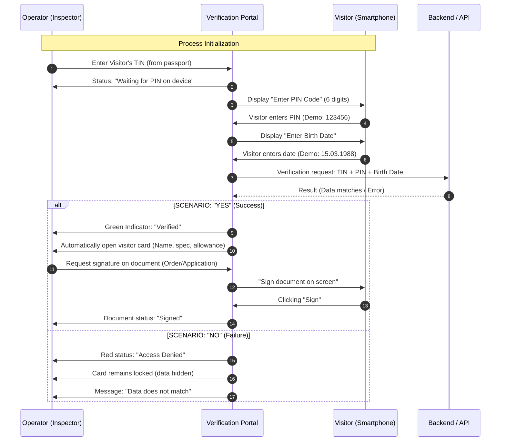

# Interaction Workflow — EN

Documentation of the identity verification process on the portal when a visitor visits the Employment Center (EC).

## UML Sequence Diagram (TIN-Authorization)

## Key Entities
- **TIN (ИНН)**: Primary identifier for DB lookup.
- **PIN Code**: Temporary access key (6 digits).
- **Visitor Card**: Object with full PII (available ONLY after verification).
