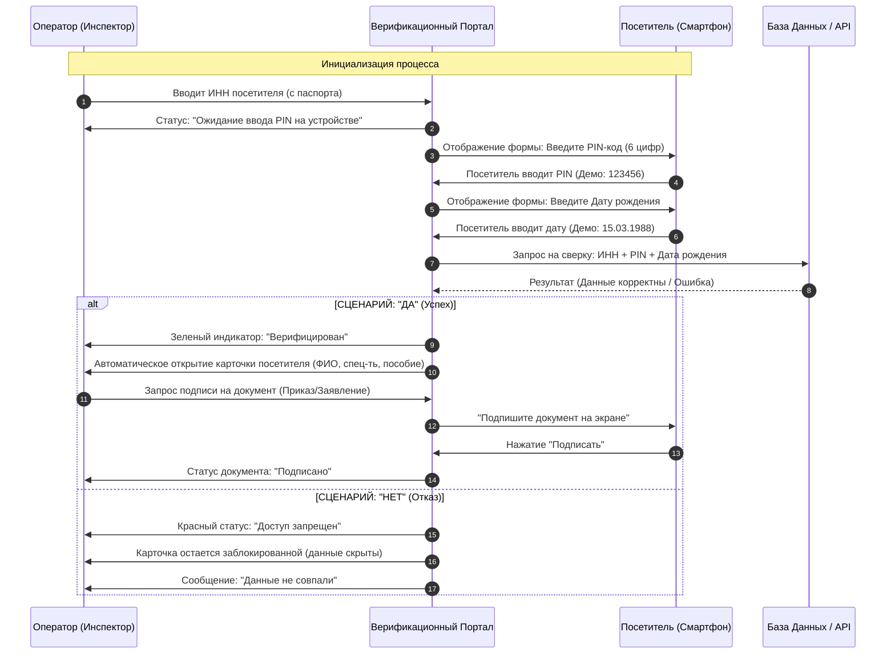

# Журнал Взаимодействия (Workflow) — RU

Документация описывает процесс верификации личности на портале при обращении посетителя в Центр занятости населения (ЦЗН).

## UML Диаграмма Последовательности (ИНН-авторизация)

## Ключевые состояния
- **ИНН (TIN)**: Первичный идентификатор для поиска в БД.
- **PIN-код**: Временный ключ доступа (6 знаков).
- **Карточка**: Объект с полными персональными данными (только после верификации).
